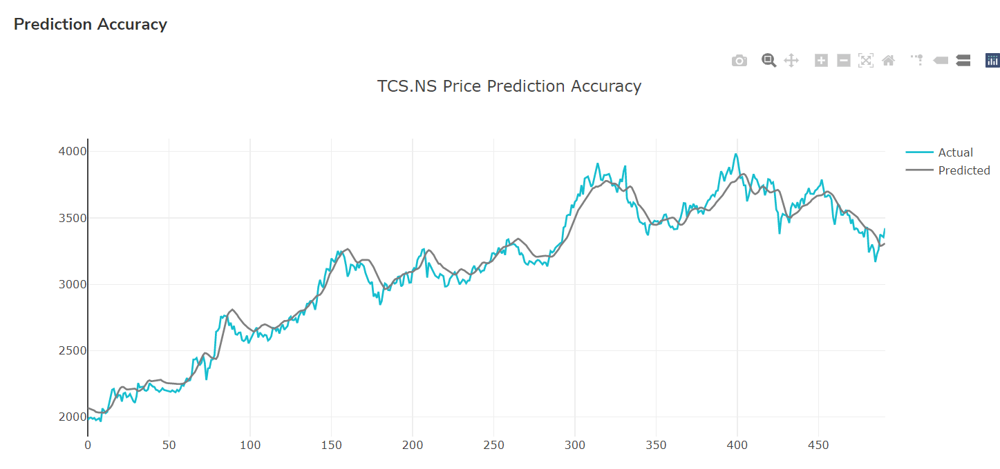

# Stock-Prediction-Web-Application-Using-LSTM

The main application part of the website starts with a typical login and registration page. Upon successful authentication, the users are greeted with the main dashboard. The dashboard provides the daily price statistics for popular stocks, cryptocurrencies, and ForEx currencies. The user can directly select a symbol from the dashboard itself to view its past trends or market summary data, or they can choose to visit the dedicated pages to retrieve market data run predictions from the navigation section.

The web application provides the users with three different pages for stocks, cryptocurrencies, and ForEx currencies. Here the user is presented with a search bar with two fields, one to search for the symbol of a particular stock, cryptocurrency, or ForEx currency and the second for selecting the range of the market summary data to be fetched and displayed.

Upon submit they are presented with the requested data in a candlestick graph that effectively represents the market data in detail. 

Upon clicking the ‘Get Predictions’ button, the Python script for the prediction model runs on the server in the back end. The model is designed to retrieve the last 5 years of market data for the selected stock, cryptocurrency, or ForEx currency and feed it to the prediction model based on LSTM and generate a prediction accuracy test plot and predict the closing price for the selected stock, cryptocurrency, or ForEx currency for the next seven days.

## HOW-TO
  1. Install XAMPP and start the Apache and MySQL servers
  2. Install Python 3
  3. Open the terminal and run the command 'pip3 install -r requirements.txt' to install the required python libraries
  4. Go to 'https://rapidapi.com/apidojo/api/yh-finance' and sign up to get a your own API Key
  5. Paste this API Key in place of 'PASTE YOUR API KEY HERE' inside 'dashboard.php' (Total 4 Occurences)
  6. Create a new phpMyAdmin database named 'wallhints'
  7. Import 'wallhints.sql' into the newly created database
  8. Create a new folder named 'wordpress' inside the 'htdocs' folder in XAMPP installation directory
  9. Create a new folder named 'application' inside the newly created 'wordpress' folder
  10. Extract the contents of this repository inside the newly created 'application' folder
  11. Visit 'http://localhost/wordpress/application/' to launch the application
